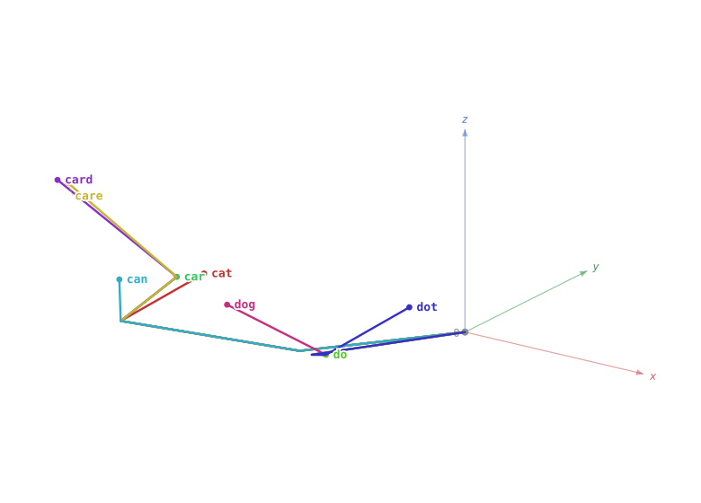

# SCS — A Spherical-Coordinate Chain Representation of Text

*A self-describing, reversible encoding of symbol sequences in 3D.*

**Interactive demonstrator: https://scs.bago.one**



*A vocabulary rendered under the word-local encoding: words sharing a spelling prefix share the initial segment of their path and branch where spellings diverge — the vocabulary fans out into a 3D prefix tree.*

## Abstract

We present a method for representing text — or any sequence over a fixed symbol
alphabet — as a chain of unit vectors in three-dimensional space, expressed in
spherical coordinates. Each symbol maps to one step vector (r, α, φ): the azimuth
φ encodes the symbol's identity through a 90-position dial spaced at 4° (printable
ASCII with its five least-frequent characters removed), while the elevation α
accumulates by a fixed increment per symbol, so that successive steps trace an
ascending spiral. Steps are joined tip-to-tail in a translational frame whose axes
remain parallel to the global frame, making both angles absolute. The
representation is *self-describing*: each step vector independently reports its
position in the sequence (from α) and its symbol (from φ), so decoding requires no
external state. We show the encoding is exactly reversible for 0° < α < 90°,
recovering the original sequence from node coordinates alone; beyond this range
steps alias and reversibility fails, which bounds the usable length. We emphasize
that this is a geometric representation and visualization, *not* a compression
scheme — stored as coordinates the chain expands rather than shrinks. The
construction adapts internal-coordinate (Z-matrix) and chain-code ideas from
chemistry and image processing to text, and induces a geometric fingerprint in
which shared prefixes trace coincident curves.

## Repository layout

| Path | Contents |
|---|---|
| [`paper/scs-preprint.md`](paper/scs-preprint.md) | Full preprint (9 sections, English) |
| [`paper/arxiv/`](paper/arxiv/) | LaTeX source + figures for the arXiv version |
| [`paper/figures/`](paper/figures/) | Figures 1–3 (SVG) |
| [`calculator/index.html`](calculator/index.html) | The interactive encoder/decoder/gallery (self-contained HTML, same as [scs.bago.one](https://scs.bago.one)) |
| [`verification/roundtrip.js`](verification/roundtrip.js) | Node script reproducing the paper's reversibility verification (§7.4 of the technical notes / §4 of the preprint) |

## Reproduce the verification

```bash
node verification/roundtrip.js
```

Expected output includes the worked example of the paper (§2.4) — `"cat"` at Δ = 10°
gives slots (65, 63, 82) and final node N₃ = (0.273, −2.322, 1.016) — and the
round-trip table, including the characteristic failure `"hello world"` at Δ = 10°
decoding to `hello wo?=5` (vertical step at α = 90° plus reflection aliasing), which
disappears at Δ = 1°.

## What this is, and is not

- **Is:** a reversible, self-describing geometric *representation* of symbol
  sequences; a visualization in which vocabularies render as 3D prefix trees; a
  deterministic geometric fingerprint for orthographic similarity.
- **Is not:** a compression scheme (stored as coordinates the chain *expands*
  15–30×; see §5 of the preprint), and the fingerprint is orthographic, not
  semantic.

## Status

Preprint; an arXiv submission is in preparation. This repository is the public
record of the work.

## Citation

Until an arXiv ID / DOI is available, please cite as:

```
[Author]. A Spherical-Coordinate Chain Representation of Text:
A Self-Describing, Reversible Encoding of Symbol Sequences in 3D. 2026.
https://github.com/billweing/scs
```

## License

- Paper text and figures (`paper/`): [CC BY 4.0](LICENSE-paper)
- Code (`calculator/`, `verification/`): [MIT](LICENSE)
