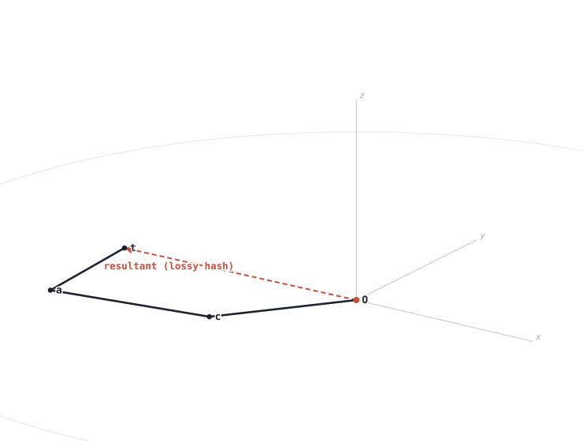

# A Spherical-Coordinate Chain Representation of Text
### A Self-Describing, Reversible Encoding of Symbol Sequences in 3D

> Working draft (English preprint, intended for arXiv). Status: abstract drafted 2026-07-08.
> Honesty rules for this manuscript: claim only what is proven (reversible, self-describing);
> it is a *representation*, not compression; quantum/collapse ideas are out of scope.

## Abstract

We present a method for representing text — or any sequence over a fixed symbol
alphabet — as a chain of unit vectors in three-dimensional space, expressed in
spherical coordinates. Each symbol maps to one step vector (r, α, φ): the azimuth
φ encodes the symbol's identity through a 90-position dial spaced at 4° (printable
ASCII with its five least-frequent characters removed), while the elevation α
accumulates by a fixed increment per symbol, so that successive steps trace an
ascending spiral. Steps are joined tip-to-tail in a translational frame whose axes
remain parallel to the global frame, making both angles absolute. The
representation is *self-describing*: each step vector independently reports its
position in the sequence (from α) and its symbol (from φ), so decoding requires no
external state. We show the encoding is exactly reversible for 0° < α < 90°,
recovering the original sequence from node coordinates alone; beyond this range
steps alias and reversibility fails, which bounds the usable length. We emphasize
that this is a geometric representation and visualization, *not* a compression
scheme — stored as coordinates the chain expands rather than shrinks. The
construction adapts internal-coordinate (Z-matrix) and chain-code ideas from
chemistry and image processing to text, and induces a geometric fingerprint in
which shared prefixes trace coincident curves.

## 1. Introduction

Text is almost always stored and manipulated as a linear stream of symbols. Yet much
of the structure in a sequence — repetition, shared prefixes, the boundary between one
token and the next — is easier to *see* than to read. This paper asks a deliberately
simple question: what happens if we turn a symbol sequence into a shape? We map each
symbol to a short step in three-dimensional space and lay the steps tip-to-tail, so
that a string becomes a path and a vocabulary becomes a family of paths.

The construction is spare. Each symbol is one unit step written in spherical
coordinates (r, α, φ). The azimuth φ — the compass bearing of the step in the
horizontal plane — encodes *which* symbol it is, through a 90-position dial spaced at
4° (the printable ASCII set with its five least-frequent characters removed). The
elevation α — how far the step tilts above the horizontal — encodes *where* the symbol
sits in the sequence: α accumulates by a fixed increment per step, so the path climbs
as it advances. The radius r is constant and carries no information. Steps are joined
in a frame whose axes stay parallel to the global frame, so both angles are absolute
rather than relative to the preceding step.

Two properties follow, and we prove both. First, the encoding is *self-describing*:
because φ fixes the symbol and α fixes the position, every step vector, taken in
isolation, reports both what it is and where it belongs — decoding needs no external
index or state. Second, it is *reversible*: within the regime 0° < α < 90° the original
sequence is recovered exactly from the node coordinates alone, with no access to the
source text. We also characterize where reversibility breaks: at α = 90° a step points
straight up and its azimuth is lost, and beyond 90° steps alias with their reflections;
together these bound the usable length to about 90°/step symbols.

We are equally explicit about what the method is *not*. It is a representation and a
visualization, not a compression scheme. A symbol carries about log₂ 90 ≈ 6.5 bits,
whereas a coordinate triple carries more, so storing the chain as geometry *expands*
the data rather than shrinking it; the right way to store a chain is to keep the symbol
sequence and redraw the geometry on demand. We make this precise in Section 5, because
the geometric framing invites the opposite — and incorrect — intuition.

The payoff of the geometric view is legibility. A small change to the encoding —
accumulating α from the start of each *word* rather than the start of the text — makes
a word's shape independent of where the word appears. Identical words then trace
identical shapes, and words that share a spelling prefix share the initial segment of
their path. Rendered together, a vocabulary fans out from the origin into a
three-dimensional **prefix tree** (Figure 1): common beginnings bundle near the root
and branch where spellings diverge, and repeated words coincide exactly. The structure
is not imposed; it is a direct consequence of a deterministic, per-symbol map.


**Figure 1.** *A vocabulary as a three-dimensional prefix tree.* Each word is drawn as a
chain of unit steps from a common origin under the word-local encoding (azimuth =
character, elevation = within-word position, 10° step). Words sharing a spelling prefix
share the initial segment of their path and branch where they differ; identical words
coincide. Vocabulary: {cat, car, card, care, can, dog, do, dot}. Rendered by the
accompanying tool.

**Contributions.** We (i) define a spherical-coordinate chain encoding of symbol
sequences in which azimuth carries identity and cumulative elevation carries position,
making each step vector self-describing; (ii) prove exact reversibility within
0° < α < 90° and characterize the failure modes and resulting length bound; (iii) give
an information-theoretic account of why the representation does not compress; (iv)
introduce a word-local variant whose shapes are position-invariant, so a vocabulary
renders as a 3D prefix tree with identical words coinciding and shared prefixes shared;
and (v) provide an interactive tool that encodes, decodes-and-verifies, and renders all
of the above.

**Relation to prior work.** The construction adapts two mature ideas to a new use.
Internal-coordinate (Z-matrix) representations in chemistry place each atom relative to
its predecessors by a length and two angles; Freeman chain codes in image processing
encode a curve as a sequence of quantized step directions. We apply the same
relative-step idea to text, binding symbol identity to direction, and relate the
resulting word shapes to the "word as trajectory" view familiar from word-gesture
keyboards. Section 7 develops these connections; here we note only that, to our
knowledge, the use of an internal-coordinate chain as a reversible, self-describing
representation of text — and the prefix-tree visualization it induces — has not been
described.

---

## 2. Encoding

We encode a sequence of symbols s₁ s₂ … s_n. Each symbol contributes one step; the k-th
step is a vector v_k written in spherical coordinates (r, α, φ) and interpreted in a
frame attached to the previous node (Section 2.4). The three coordinates play distinct
roles: φ carries the symbol's identity, α carries its position in the sequence, and r is
a fixed scale.

### 2.1 Azimuth φ — symbol identity

We fix an alphabet of 90 symbols: the 95 printable ASCII characters (0x20–0x7E) with the
five least-frequent removed (`` ` ^ ~ { } ``). The remaining characters, in ASCII order,
occupy slots 0–89, and a symbol's azimuth is

> φ(s) = slot(s) × 4°,  slot(s) ∈ {0, …, 89},  φ ∈ {0°, 4°, …, 356°}.

Choosing 90 makes 360° divide evenly, so every azimuth is an integer multiple of 4°. The
empty symbol occupies no slot; it is represented by a zero-length step (r = 0), read back
as "no content." Because ASCII orders characters contiguously, like symbols land in
contiguous arcs of the dial (digits at 64°–100°, uppercase at 132°–232°, lowercase at
252°–352°).

### 2.2 Elevation α — sequence position

The elevation accumulates by a fixed increment Δ per symbol,

> α_k = k · Δ,  with default Δ = 10°.

Because α advances monotonically, position is recorded by the geometry itself: the k-th
step tilts higher than the (k−1)-th, and k = α_k / Δ recovers the index. No separate
position field is stored. Section 4 shows this is exactly what makes the code
self-describing, and what bounds its length.

### 2.3 Radius r

The radius is constant, r = 1, and carries no information; it sets the step length. (A
variant that lets r grow with k is possible but unused here.)

### 2.4 Step vector, frame, and chain

We measure α from the horizontal (xy) plane — an elevation, not a zenith angle — so that
small angles give near-horizontal steps with a large horizontal projection. The Cartesian
step is

> sph(r, α, φ) = (r cos α cos φ,  r cos α sin φ,  r sin α),

with horizontal component r cos α and vertical component r sin α. Steps are laid
tip-to-tail from the origin N₀ = O:

> N_k = N_{k−1} + R_{k−1} · sph(v_k).

We use the **translational frame**: every node frame keeps its axes parallel to the
global frame (R_k = I), so the two angles are absolute — φ from the global +x axis, α from
the global horizontal — and R_{k−1} · sph(v_k) = sph(v_k). This is the property that lets
a single step be decoded in isolation (Section 3). An alternative co-moving frame that
rotates +z onto the incoming direction makes α a bend angle relative to the previous step;
it is more expressive but unnecessary here, since position is already carried by
cumulative α.

As a worked example, "cat" at Δ = 10° gives slots (65, 63, 82), azimuths (260°, 252°,
328°), elevations (10°, 20°, 30°), and nodes N₁ = (−0.171, −0.970, 0.174),
N₂ = (−0.461, −1.864, 0.516), N₃ = (0.273, −2.322, 1.016).

---

## 3. Self-description and decoding

### 3.1 The self-describing property

Call an encoding *self-describing* if each step vector, examined on its own — without its
neighbours and without a stored index — determines both the symbol it carries and its
position in the sequence. The construction of Section 2 has this property on the
reversible regime.

Under the translational frame a step is v_k = sph(1, α_k, φ_k) in global coordinates,
with α_k = k·Δ and φ_k = slot(s_k)·4°. From the components of v_k alone,

> r = |v_k|,  α = arcsin(v_{k,z} / r),  φ = atan2(v_{k,y}, v_{k,x}),

and therefore

> k = α / Δ  (position),  slot = round(φ / 4°)  (symbol).

No neighbouring step, running index, or table of offsets is consulted: a lone vector
reports *what it is* through its bearing and *where it belongs* through its tilt. This
follows directly from the two design choices of Section 2 — absolute angles (the
translational frame) and cumulative elevation. In a co-moving frame the elevation would
be a bend relative to the previous step, and a single vector could no longer name its
absolute position; the property would be lost. (Under the word-local variant of Section 6
the same holds, with k reading the position *within the current word* and a reset of α
marking a word boundary.)

### 3.2 Decoding a chain

To decode we are given the node coordinates N_0, N_1, …, N_n — pure geometry, with no
access to the source text — together with the protocol (the increment Δ, the 90-symbol
dial, the translational frame). For each step we recover the displacement and read off
its symbol:

```
decode(N_0 … N_n):
  for k = 1 … n:
      v = N_k − N_{k−1}       # translational frame ⇒ v is the global step
      r = |v|
      if r ≈ 0:  emit ∅ (empty symbol); continue
      α    = arcsin(v_z / r)
      φ    = atan2(v_y, v_x)  (mod 360°)
      slot = round(φ / 4°) mod 90
      emit CHARSET[slot]
  return the emitted sequence
```

Because the chain already presents its steps in order, the index k obtained from α is
*redundant* with a step's ordinal position. We keep it deliberately: whenever
round(α/Δ) disagrees with a step's place in the chain, the discrepancy flags corruption
or a frame error. Self-description thus doubles as a built-in checksum.

### 3.3 A fragment locates itself

Self-description has a consequence the whole-chain view obscures: one need not have the
whole chain to read part of it. Any single step — equivalently, any adjacent pair of
nodes — yields both its character and its absolute index. A fragment cut from the middle
of a chain therefore *self-locates*: it announces which symbols it holds and where, in
the original sequence, they sat, with no header and no surrounding context. We exploit
this for the fingerprints of Section 6, and it fails exactly where reversibility fails,
at α ≥ 90°.

### 3.4 Correctness

Decoding is exact precisely when the map (α, φ) ↦ direction is injective over the
elevations used. It is injective for 0° < α < 90°: the elevation is recovered without
ambiguity because sin is strictly monotone there, and the azimuth is then recovered
because cos α > 0. Section 4 proves this, exhibits the two ways it breaks — a vertical
step at α = 90° and reflection aliasing beyond 90° — and separates what this costs.

### 3.5 Robustness of decoding

Decoding needs two things from each step — its symbol and its position — and the geometry
supplies each in more than one way. The redundancy makes the decoder resistant to
disordering, to local corruption, and to silent failure.

**Position has three independent sources.** The symbol is read from the azimuth alone, but
a step's position k can be recovered three ways: (a) from its ordinal place in the node
list; (b) from its own elevation, k = α/Δ, since a single step in the self-describing
regime reports its index (Section 3.1); and (c) by sorting the nodes on height, since z
increases monotonically while α < 180°. Any one suffices. The last deserves stating
plainly: even a *bag of nodes with the order discarded* decodes, because sorting on z
reconstructs the order first — encoding "spiral", shuffling its seven nodes, sorting by
height, and decoding returns "spiral" exactly. When more than one source is available they
cross-check: if the index from α disagrees with the ordinal place, the discrepancy signals
corruption. The self-description of Section 3.1 thus doubles as a built-in integrity check,
at no cost.

**Decoding is local.** Each step is recovered from just its two endpoints, N_{k−1} and
N_k, so a corrupted node damages only the two steps that touch it; the error does not
propagate down the chain, unlike a sequential code in which one early error corrupts
everything after.

**Failures are detected, not silent.** Where a character cannot be recovered, the decoder
says so. A vertical step (cos α_k ≈ 0) has no azimuth: it emits a marked gap rather than a
wrong guess, and knows exactly which position is affected. A zero-length step (r ≈ 0)
decodes to the empty symbol. Near a vertical the horizontal projection is small and the
azimuth is noise-sensitive, so such steps can be flagged low-confidence instead of reported
as a spurious character.

**The sources degrade gracefully with elevation.** For 0° < α < 90° all three position
sources hold, giving maximum redundancy and letting any fragment self-locate (Section 3.3).
For 90° < α < 180° the elevation folds (b fails), but height is still monotonic (c) and the
list order (a) is intact, so full-chain decoding is unaffected. Beyond 180° height is no
longer monotonic (c fails) and only the given order remains. Reversibility rests, in the
last resort, on the ordering of the nodes — which in the common regime the geometry
reconstructs for free.

---

## 4. Reversibility

Whether the code is reversible turns on how a step vector determines its character, and
that determination changes at α = 90°. We first locate the difficulty in the isolated
vector, then show that the chain removes it.

### 4.1 The ambiguity is in the isolated coordinate

A step is decoded by reading its azimuth, φ = atan2(v_y, v_x). This returns the
character's azimuth only while the horizontal projection points along φ — that is, while
cos α > 0. Two identities of the unit direction d(α, φ) = (cos α cos φ, cos α sin φ, sin α)
govern the rest:

> d(α, φ) = d(α + 360°, φ)              (periodicity)
> d(α, φ) = d(180° − α, φ + 180°)       (reflection)

The reflection is the crux. Past vertical (α > 90°) the sign of cos α reverses, so the
horizontal projection points along φ + 180° and the azimuth reads as a *different*
character. Concretely, a step for "c" (φ = 260°) at α = 100° is the identical vector to a
step for "4" (φ = 80°) at α = 80°: both are (0.030, 0.171, 0.985). Converting that vector
back to spherical coordinates gives the single canonical reading (r = 1, α = 80°, φ = 80°)
— the "4" reading; the intended (α = 100°, φ = 260°) has folded onto its reflection. So
the map (α, φ) → direction is not injective once α passes 90°, and it is singular at the
pole α = 90° (the point (0, 0, 1)), where no azimuth exists at all. Both are defects of the
isolated spherical triple (Figure 2).

### 4.2 The chain carries the missing elevation

The encoding does not store isolated vectors; it stores an ordered chain. Step k is the
displacement v = N_k − N_{k−1}, and the chain gives its ordinal position k directly —
hence its true elevation α_k = k·Δ, even when α_k > 90°. Knowing the sign of cos α_k, the
decoder undoes the reflection,

> φ = atan2(v_y / cos α_k, v_x / cos α_k),

recovering the intended azimuth (260° = "c") rather than its fold (80° = "4"). Equivalently:
the two colliding steps are anchored at different nodes and, as directed segments in place,
are simply different segments; they coincide only if one translates them to a common
origin — the very operation that discards their position.

### 4.3 Two guarantees, of different strength

**Proposition 1 (self-describing invertibility).** On 0° < α < 90° the map
(α, φ) → direction is injective: sin is strictly monotone there, so α is recovered from
v_z; and cos α > 0, so φ is recovered from (v_x, v_y). A single step, in isolation,
therefore recovers both its position (k = α/Δ) and its symbol. This is the strong property
that lets a fragment self-locate (Section 3.3); it bounds the usable length to 90°/Δ.

**Proposition 2 (full-chain reversibility).** Given the ordered nodes, every step decodes
exactly for all α except the isolated verticals α ≡ 90° (mod 180°), where the horizontal
projection vanishes and the azimuth is undefined. There is no length bound; only those
sparse vertical steps are lost, and even they are avoided by choosing Δ so that k·Δ is
never an odd multiple of 90°.

### 4.4 Summary

The reflection ambiguity belongs to the bare coordinate triple, not to the representation:
the chain's ordering supplies the true elevation and removes it, leaving only the pole
singularity. Reversibility is thus unbounded in length for the full chain, and limited to
90°/Δ only when one demands the stronger, position-free self-description.

---

## 5. It is not compression

A symbol carries about log₂ 90 ≈ 6.5 bits. The geometric picture invites three hopes of
beating that figure — pack more into each vector, summarize a string by its resultant, or
store a whole phrase as one vector. Each holds a grain of truth and a hard limit; together
they fix what the representation can and cannot do.

### 5.1 A vector is a bounded channel

The capacity of one vector is the number of distinguishable states of its coordinates, and
that number grows only *logarithmically* as the coordinates are refined:

| azimuth resolution | divisions per turn | bits |
|---|---:|---:|
| 4° | 90 | 6.49 |
| 1° | 360 | 8.49 |
| 1′ (arcminute) | 21,600 | 14.40 |
| 1″ (arcsecond) | 1,296,000 | 20.31 |

Refining the azimuth from 4° to one arcsecond — 14,400× finer — raises its capacity only
from 6.5 to 20.3 bits. Loading every coordinate at arcsecond precision — azimuth (≈20 bits),
elevation (≈19 bits), a finely graded radius (≈20 bits), a few discrete style states such
as colour or dashing (≈4 bits) — a single vector then holds on the order of **60 bits, about
ten characters**. That is a real and useful gain over the 6.5 bits of the 4° dial, but a
one-time and bounded one: capacity is capped by a precision floor (double precision resolves
about 52 bits per number; any noisy medium far fewer), and doubling it requires *squaring*
the number of divisions. A vector is a channel of a few dozen bits — generous, but not
unbounded.

### 5.2 The resultant is a lossy hash, not a compression



**Figure 3.** *The resultant of "cat".* The chain O→c→a→t (black) and its resultant — the
straight segment from the origin to the last node (red, dashed). The resultant is a lossy
hash of the string: many strings share it, and it cannot be decoded back to the string.

Summing a chain's steps gives a single resultant vector, the straight segment from the
origin to the last node (the dashed line for "cat" in Figure 3). It is tempting to treat
this as a compact stand-in for the whole string. The sum is lossy, however: a string of
length n has 90ⁿ possibilities, while the resultant is three numbers in a bounded region, so
by the pigeonhole principle many strings share a resultant — already 5.9 billion strings of
length five map into one bounded 3-vector. Its length alone, a single number, collides far
worse: infinitely many strings share it. The resultant is thus a *fingerprint* or *hash* —
useful for comparison and for low-collision matching of short strings — but it cannot be
decoded back to the string, because no information has been kept that would reconstruct it.
A hash is not a compression. Reversibility lives only in the full chain (Section 4); the
resultant discards it.

### 5.3 Phrases, dictionaries, and where savings come from

A whole phrase can indeed be given a single vector, but only in one of two ways, and neither
escapes the entropy of the text. As a resultant it is the lossy hash of §5.2 — not
recoverable. As a *dictionary index*, one code pointing to a stored phrase, it is ordinary
dictionary coding: the saving is real, since natural text is redundant and a good dictionary
or tokenizer reaches roughly 1–2 bits per character, but the phrase still lives in the
dictionary and the total does not fall below the text's entropy. This saving is a property
of the language's redundancy, not of the geometry; the chain neither adds to it nor subtracts
from it.

### 5.4 What the representation costs

The information a chain holds is (number of vectors) × (bits per vector), and both factors
are bounded — the bits per vector by precision, the count being exactly what must grow to
hold more content. For an encyclopedia of ten million characters, the entropy floor is about
1–2 MB once redundancy is removed (a purpose-built dictionary reaches ~2 MB; the best
compressors in existence reach ~1 MB), while the raw 90-symbol stream is 7.7 MB. Stored as
floating-point coordinates, the same chain occupies **34–69 MB — fifteen to thirty times the
text**, because each 6.5-bit symbol becomes three floating-point numbers. The right way to
keep a chain is therefore to store the symbol sequence and redraw the geometry on demand.
None of the three hopes beats the entropy of the input: packing coordinates finely buys a
bounded one-time factor, the resultant loses the string, and a dictionary merely relocates
it. The value of the representation is legibility and reversibility, not compression.

---

## 6. Geometric fingerprints

A deterministic, per-symbol map turns a string into a shape and a vocabulary into a family
of shapes. The shapes are not arbitrary: their structure records the structure of the
words, and reading it back is what makes the representation useful for matching (Section 8).

### 6.1 Shared prefixes coincide

In the cumulative encoding of Section 2 the k-th step depends only on the k-th symbol and on
k, so two strings that begin alike begin identically — equal prefixes give equal step
vectors and equal partial chains. Drawn from a common origin, two strings trace coincident
curves up to the first position at which they differ, and fork there; the chain is thus a
visual diff of two strings aligned at their heads. In this mode, however, the fingerprint is
tied to the start of the text: because α accumulates from the first symbol, the same word
occurring later sits at higher elevations and traces a different shape.

### 6.2 Position-invariant word shapes

One change frees a word's shape from its position. Let α accumulate from the start of each
*word* rather than the start of the text — reset at each delimiter, the j-th letter of a
word taking α = j·Δ. A word's step vectors then depend only on its spelling, so identical
words trace congruent shapes wherever they occur, and the reset of α marks each word
boundary as a sawtooth in elevation, so segmentation is read from the geometry itself.
Within the length bound of Section 4 (a word of more than 90°/Δ letters re-enters the
vertical) the map from word to shape is injective up to translation: two words trace the
same shape only if they are the same word.

### 6.3 The vocabulary as a prefix tree

Over a whole vocabulary these combine. Every word is a path from the origin; words sharing a
spelling prefix share the initial segment of their path (§6.1) and branch where they differ;
identical words coincide (§6.2). A vocabulary therefore renders as a three-dimensional
**prefix tree** — a trie drawn in space (Figure 1) — not by construction but as a consequence
of the deterministic map. Common beginnings bundle near the root, each fork marks where
spellings diverge, and the depth of a leaf is a word's length.

### 6.4 Similarity, and its limits

The geometry places similar words near one another: two words differing in a single letter
share every step but one and trace nearly-coincident shapes, and the distance between two
shapes grows with the edit distance of their spellings. This is the structure §8.2 uses for
approximate retrieval. Two limits are worth stating plainly. The similarity is
*orthographic*, not semantic — "cat" and "cot" are close, "cat" and "feline" are not — and
it is *ordered*: the shape distinguishes anagrams ("cat" and "act" trace different paths),
which is right for identity but means the fingerprint is not invariant to permuting letters.
A signature invariant to rotation, scale, or meaning would need a different construction; we
leave these as open directions (Section 9).

---

## 7. Related work

The construction borrows several established ideas and applies them to a use they have not
been put to. We name the closest and mark what is, and is not, new here.

**Internal coordinates (Z-matrix).** In computational chemistry a molecule is specified in
*internal coordinates* — each atom placed relative to earlier ones by a bond length and one
or two angles — rather than in absolute Cartesian coordinates. This is the same relative-step
idea as ours: a length and angles positioning each unit with respect to its predecessor.
Protein backbones are described, and generated, from such coordinates one residue after
another, with no explicit index — order carried by the chain, exactly as here. Of the
precedents this is the closest; our contribution is not the internal-coordinate chain but
its use as a *reversible, self-describing encoding of text*, and the reading of the shapes
it produces.

**Chain codes.** Freeman's chain code represents a digitized curve as a sequence of quantized
step directions and is a staple of contour representation in image processing; three-
dimensional and differential variants exist. We share the "curve as a sequence of unit steps"
idea but invert the purpose: a chain code *describes* a given shape compactly, whereas we
*manufacture* a shape from symbols, binding a symbol's identity to a step's direction.

**Turtle graphics and L-systems.** Turtle geometry defines a figure as a stream of
elementary move-and-turn instructions, and L-systems generate the branching forms of plants
and fractals by rewriting strings into such instruction streams. The string↔geometry
correspondence is the one we use to encode and decode; our map is simply a fixed, invertible
instruction per symbol rather than a generative grammar.

**Word-gesture keyboards.** Shape-writing systems (SHARK², ShapeWriter) represent each word
as a geometric trajectory over a keyboard layout and recognize words by matching
trajectories. The "word as a shape" idea is theirs; the difference is that their shapes come
from an arbitrary key layout, whereas ours are a canonical, layout-independent function of
spelling, and are reversible.

Across these, the gap our work occupies is the use of an internal-coordinate chain as a
*reversible, self-describing representation of text* — and the prefix-tree visualization it
induces (Section 6), which we have not found described elsewhere.

---

## 8. Applications

The representation does not compress (Section 5), yet the same structure that denies it
compression makes it useful for *distribution* and *retrieval*. We sketch three uses. Each
is a systems benefit — a matter of where information sits and how fast it is matched — not a
claim of beating entropy.

### 8.1 A shared geometric standard

The map from symbols to vectors is a public convention, exactly as ASCII is a public
convention from bytes to characters: nothing about it needs to travel with a message.
Raising the convention from single characters to common words, phrases, and document
templates — a standard dictionary of *stock chains* — lets a document be represented by
references into that shared standard rather than by its full character stream. Like ASCII,
the dictionary is distributed once and shared by everyone; a document then carries only its
references. This removes, for free, the redundancy that is *common to all documents* —
frequent words, boilerplate, formatting. What it cannot remove is a document's *own*
content: a public standard cannot contain the specific text of every possible document, so
a document's unique information still travels, and by Section 5 that quantity is its
entropy. In the terms of §5.4 the shared dictionary is amortized across the corpus, and
each document pays only for what is unique to it — no more, and no less.

### 8.2 Fingerprints for matching and deduplication

Because the encoding is deterministic and shared prefixes trace shared paths (Section 6), a
word or phrase has a distinctive geometric signature, and *similar* strings have *similar*
signatures. This is what makes the shared dictionary practical: to decide whether a phrase
is already known, one compares signatures rather than raw text, and near-matches surface as
nearby shapes. For *exact* matching a signature is no better than a hash; the geometric
advantage is *approximate* retrieval — nearest-neighbour search over signatures finds
paraphrases and near-duplicates that an integer token id cannot. The lossy resultant of
§5.2 serves as a cheap first-pass key; the full chain confirms an exact match.

### 8.3 A compact working representation

Tokenized against a shared standard, a document is a few hundred thousand vectors rather
than millions of characters. For operations that run over the token stream — comparison,
search, similarity — the smaller, richer stream can be faster to process and lighter to hold
in memory, provided the shared dictionary is a resident resource rather than reloaded per
document. These are the ordinary benefits of any tokenized representation; the geometry adds
the similarity structure of §8.2 on top. None of this lowers the total information in a
corpus below its entropy. It changes only *where* that information sits — in the shared
standard — and *what* each document must carry: only its own.

---

## 9. Limitations and outlook

We collect the boundaries of the method, several already noted in place.

**The pole.** A step at exactly α = 90° points straight up and has no azimuth; its character
is unrecoverable regardless of context (Section 4). The loss is a single, *detected* position
and is avoided by choosing Δ so that k·Δ is never an odd multiple of 90°, but the pole is an
intrinsic singularity of the spherical coordinate, not an artifact we can design away.

**Bounded per-vector capacity.** A vector carries a fixed number of bits, capped by precision
— a few dozen at double precision, fewer in a noisy medium (Section 5). Refining the
coordinates buys only logarithmic, one-time gains. The representation grows with the content
it holds; it does not compress, and stored as coordinates it is larger than the text.

**Orthographic, ordered similarity.** The fingerprint of Section 6 measures spelling, not
meaning, and is sensitive to letter order (it separates anagrams). It is not invariant to
rotation, scale, or paraphrase. Signatures with any of these invariances — a semantic one
above all — would need a different construction.

**Alphabet.** The dial covers 90 printable ASCII characters, the five least-frequent dropped
to keep the geometry clean; non-ASCII and multibyte text are not yet handled. A larger or
hierarchical dial would extend it, at some cost in angular resolution.

**Length and segmentation.** The self-describing property and the position-invariant word
fingerprint hold only up to the length bound of Section 4; long words need a smaller Δ, and
the word-local mode relies on an explicit delimiter to reset α.

**Outlook.** The most useful next steps are a signature invariant to position, rotation, and
scale for robust retrieval; a semantic rather than orthographic embedding; and an evaluation
of geometric approximate-matching (Section 8) against standard string- and token-based
baselines on a real deduplication or retrieval task. This paper establishes the
representation and its properties; whether the geometric structure earns its place against
those baselines is the question we leave for that evaluation.

---

## References

> Bibliographic details below are provisional and must be verified (exact pages, years,
> venues) before submission.

1. H. Freeman. *On the encoding of arbitrary geometric configurations.* IRE Transactions
   on Electronic Computers, EC-10(2):260–268, 1961.
2. H. Abelson and A. diSessa. *Turtle Geometry: The Computer as a Medium for Exploring
   Mathematics.* MIT Press, 1981.
3. A. Lindenmayer. *Mathematical models for cellular interactions in development, I & II.*
   Journal of Theoretical Biology, 18:280–315, 1968.
4. P. Prusinkiewicz and A. Lindenmayer. *The Algorithmic Beauty of Plants.* Springer, 1990.
5. P. Pulay, G. Fogarasi, F. Pang, and J. E. Boggs. *Systematic ab initio gradient
   calculation of molecular geometries, force constants, and dipole moment derivatives.*
   Journal of the American Chemical Society, 101(10):2550–2560, 1979. (internal coordinates)
6. S. Zhai and P. O. Kristensson. *Shorthand writing on stylus keyboard.* In Proc. CHI 2003,
   pp. 97–104.
7. P. O. Kristensson and S. Zhai. *SHARK²: a large vocabulary shorthand writing system for
   pen-based computers.* In Proc. UIST 2004, pp. 43–52.
8. S. Zhai and P. O. Kristensson. *The word-gesture keyboard: reimagining keyboard
   interaction.* Communications of the ACM, 55(9):91–101, 2012.

---

*Draft complete: all nine sections. Remaining before posting: verify the references above,
and a full read-through. Figures 1–3 in place.*
3. **Self-description & decoding** — why each vector carries its own index and symbol; the decode algorithm from geometry alone.
4. **Reversibility & its limits** — proof of exact round-trip for 0°<α<90°; the α=90° φ-loss and >90° aliasing; length bound = 90°/step.
5. **It is not compression** — the information-content argument; coordinate storage expands; step-size vs. precision floor.
6. **Geometric fingerprints** — shared-prefix coincidence; the position-dependence limitation and a route to position-invariant fingerprints.
7. **Related work** — internal coordinates (Z-matrix), Freeman chain codes, turtle graphics / L-systems, word-gesture keyboards.
8. **Limitations & outlook** — honest scope; open problems.
